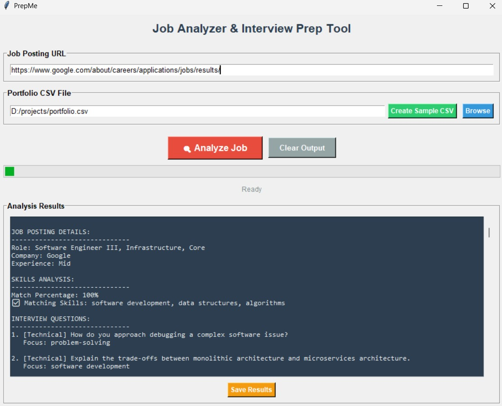

# PrepMe: AI-Powered Job Analyzer and Interview Preparation Tool

**PrepMe** is an intelligent desktop application that assists job seekers in preparing for technical and behavioral interviews. It combines automated web scraping with portfolio-based matching and generative AI to provide:

- Tailored interview questions
- Skill-gap analysis
- Customized preparation tips

Whether you're applying for a software engineering role, a data science position, or another tech career, PrepMe helps bridge the gap between your resume and the job description.

### Key Features

- **Job Scraping**: Automatically extracts job descriptions from public job listing URLs (supports both static and JavaScript-rendered pages using Selenium + Edge).
- **Portfolio Matching**: Accepts a CSV of your skills, years of experience, proficiency levels, and project count to match against job requirements.
- **LLM Integration**: Uses a Groq-hosted language model to:
  - Summarize job roles
  - Compare job skills with user portfolio
  - Generate 10+ tailored technical, behavioral, and role-specific interview questions
  - Provide actionable preparation tips
- **Graphical Interface**: Built using `tkinter` for ease of use.
- **JSON + Text Export**: Save analysis results in structured or readable format.

---
## Interface Overview

Below is the PrepMe user interface:



### Interface Components Explained

1. **Job Posting URL**  
   Input field where users paste the URL of a job listing (e.g. from Google Careers, LinkedIn, etc.).

2. **Portfolio CSV File**  
   Input field to browse and load a CSV file containing the user's skills and experience.  
   - A sample CSV can be generated using the "Create Sample CSV" button.
   - It should contain a 'Technology' field.

3. **Analyze Job**  
   Starts the job analysis process:
   - Fetches job details from the URL.
   - Matches it with skills in the portfolio.
   - Generates interview questions and preparation tips using a language model.

4. **Clear Output**  
   Clears the output window.

5. **Progress Bar**  
   Shows analysis status while the job is being processed.

6. **Status Label**  
   Displays the current status of the application (e.g. Ready, Processing...).

7. **Analysis Results**  
   Displays structured output including:
   - Role, company, and experience level
   - Skills match percentage
   - Matching skills
   - Interview questions (technical, behavioral, and role-specific)
   - Preparation tips

8. **Save Results**  
   Allows exporting results to a `.json` or `.txt` file.

---
You can now scroll down to see [Setup Instructions](#setup-instructions) to get started.
---

## Setup Instructions

### 1. INSTALL DEPENDENCIES

Run the following command in terminal:
```
./install_dependencies.sh
```

This will:
- Create a Python virtual environment (`venv`)
- Install all required packages using pip

If you are on Windows, use:
```
bash install_dependencies.sh
```
or manually install packages using pip:
```
pip install -r requirements.txt
```

---

### 2. BROWSER DRIVER (Edge)

Make sure Microsoft Edge is installed.

The script will automatically download Edge WebDriver using `webdriver-manager`.
No manual setup required.

---

### 3. API KEY (Groq / OpenAI)

Set your Groq API Key in the script:
- Open `prepme.py`
- Locate the line: `groq_api_key=...`
- Replace it with your actual key

---

### 4. RUNNING THE APP

To launch the GUI:
```
python prepme.py
```

To test job extraction only:
- You can modify the `extract_job_data` function to run standalone.

---

### 5. TIPS

- Microsoft Edge must be installed.
- If the job site uses JavaScript (e.g., Google Careers), the Edge WebDriver is essential.
- Only static HTML pages can be scraped without a browser.

---

### 6. CLEANUP

To remove the virtual environment:
```
deactivate
rm -rf venv
```
